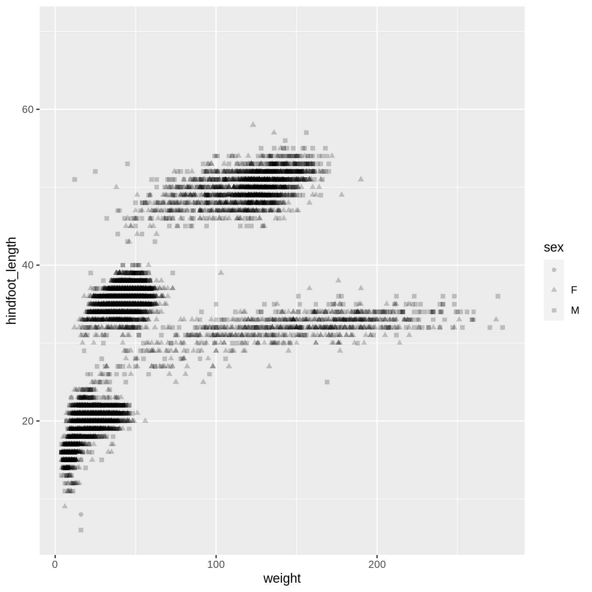
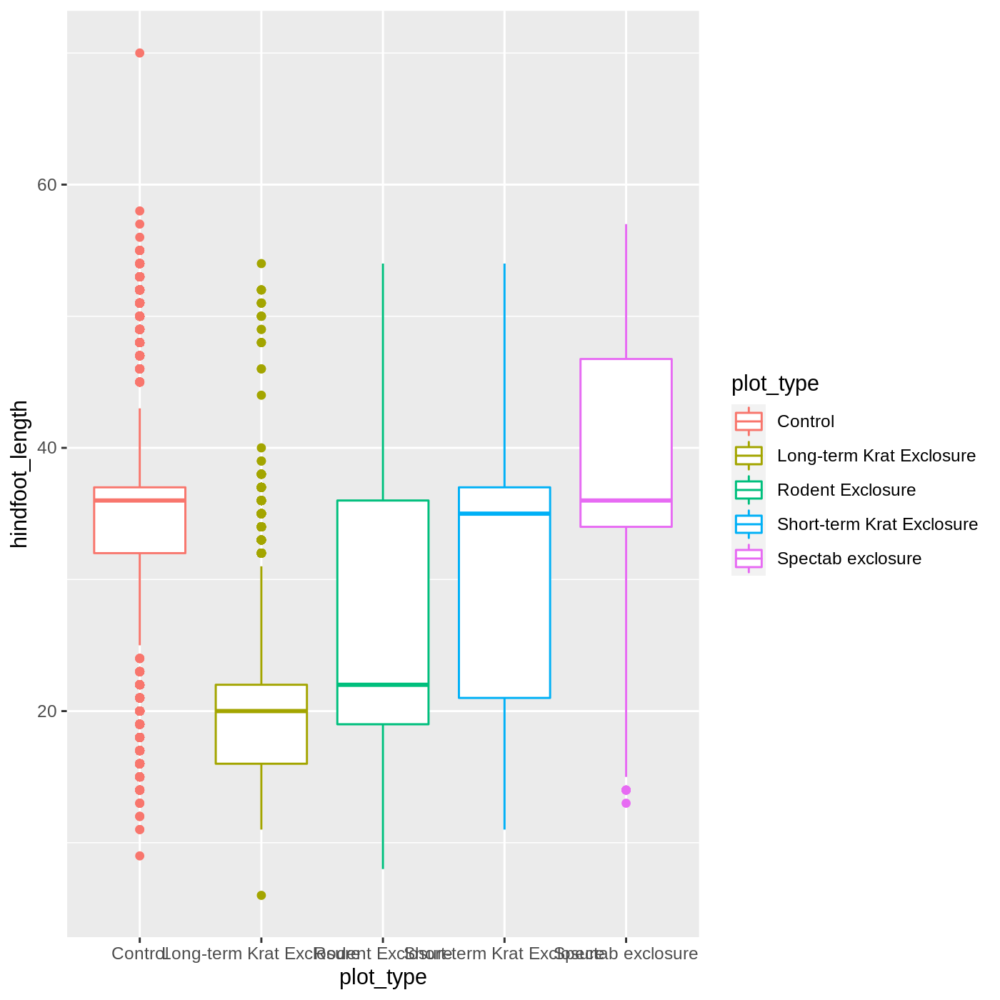
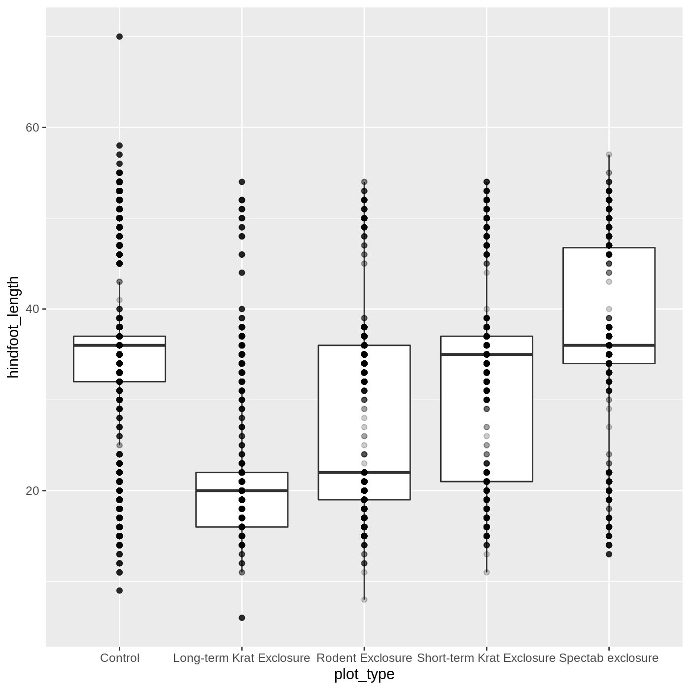

:::::::::::::::::::::::::::::::::::::: questions 

- How do you make plots using R?

::::::::::::::::::::::::::::::::::::::::::::::::

::::::::::::::::::::::::::::::::::::: objectives

- Produce scatter plots and boxplots using ggplot.
- Map data variables to plot components.
- Modify the scales of plot components.
- Iteratively build and modify ggplot plots by adding layers.
- Change the appearance of existing ggplot plots using premade and customized themes.
- Describe what faceting is and apply faceting in ggplot.
- Combine and export plots.

::::::::::::::::::::::::::::::::::::::::::::::::

## Setup


We are going to be using **functions** from the **`ggplot2`** package to create visualizations of data. Functions are predefined bits of code that automate more complicated actions. R itself has many built-in functions, but we can access many more by loading other **packages** of functions and data into R.

We start by loading the **`ggplot2`** package, using the `library()` function.


```r
library(ggplot2)
```

Later we will learn how to read data into R, but for now we are going to use a clean and ready-to-use dataset that is provided by the **`ratdat`** data package. To make our dataset available, we need to load this package too.


```r
library(ratdat)
library(dplyr)
surveys <- left_join(left_join(surveys, species), plots) %>% 
  mutate(across(where(is.factor), as.character)) %>% 
  filter(year < 1990)
```

The `ratdat` package contains data from the [Portal Project](https://github.com/weecology/PortalData), which is a long-term dataset from Portal, Arizona, in the Chihuahuan desert.

## Plotting with **`ggplot2`**

**`ggplot2`** is a powerful package that allows you to create complex plots from tabular data (data that can be stored in a table). The **`gg`** in **`ggplot2`** stands for "grammar of graphics", and the package uses consistent vocabulary to create plots of widely varying types. Therefore, we only need small changes to our code if the underlying data changes or we decide to change from a box plot to a scatter plot. This approach helps you create publication-quality plots with minimal adjusting and tweaking.

**`ggplot2`** is part of the **`tidyverse`** series of packages, which tend to like data in the "long" or "tidy" format, which means each column represents a single variable, and each row represents a single observation. Well-structured data will save you lots of time making figures with **`ggplot2`**. For now, we will use data that are already in this format. We start learning R by using **`ggplot2`** because it relies on concepts that we will need when we talk about data transformation in the next lessons.

**`ggplot`** plots are built step by step by adding new layers, which allows for extensive flexibility and customization of plots.

::::::::::::::::::::::::::::: callout

R does not care about whitespace or indentation, so any spacing or indentation you see is simply to improve readability of the code.

:::::::::::::::::::::::::::::

To build a plot, we will use a basic template that can be used for different types of plots:

```r
ggplot(data = <DATA>, mapping = aes(<MAPPINGS>)) + <GEOM_FUNCTION>()
```

We use the `ggplot()` function to create a plot. In order to tell it what data to use, we need to specify the `data` **argument**. An argument is an input that a function takes, and you set arguments using the `=` sign.


```r
ggplot(data = surveys)
```


We get a blank plot because we haven't told `ggplot()` which variables we want to correspond to parts of the plot. We can specify the "mapping" of variables to plot elements, such as x/y coordinates, size, or shape, by using the `aes()` function. We'll also add a comment, which is any line starting with a `#`. It's a good idea to use comments to organize your code or clarify what you are doing.


```r
# adding a mapping to x and y axes
ggplot(data = surveys, mapping = aes(x = weight, y = hindfoot_length))
```


Now we've got a plot with x and y axes corresponding to variables from `surveys`. However, we haven't specified how we want the data to be displayed. We do this using `geom_` functions, which specify the type of `geom`etry we want, such as points, lines, or bars. We can add a `geom_point()` layer to our plot by using the `+` sign:


```r
ggplot(data = surveys, mapping = aes(x = weight, y = hindfoot_length)) +
  geom_point()
```

```{.warning}
Warning: Removed 3081 rows containing missing values (geom_point).
```


You may notice a warning that missing values were removed. If a variable necessary to make the plot is missing from a given row of data (in this case, `hindfoot_length` or `weight`), it can't be plotted. `ggplot2` just uses a warning message to let us know that some rows couldn't be plotted.


::::::::::::::::::::::::::::: callout

**Warning** messages are one of a few ways R will communicate with you. Warnings can be thought of as a "heads up". Nothing necessarily went *wrong*, but the author of that function wanted to draw your attention to something. In the above case, it's worth knowing that some of the rows of your dataframe were not plotted because they had missing data.

A more serious type of message is an **error**. Here's an example:


```r
ggplot(data = surveys, mapping = aes(x = weight, y = hindfoot_length)) +
  geom_poit()
```

```{.error}
Error in geom_poit(): could not find function "geom_poit"
```

As you can see, we only get the error message, with no output, because something has actually gone wrong. This particular error message is fairly common, and it happened because we misspelled `point` as `poit`. Because there is no function named `geom_poit()`, R tells us it can't find a function with that name.

:::::::::::::::::::::::::::::

## Changing aesthetics

Building **`ggplot`** plots is often an iterative process, so we'll continue developing the scatter plot we just made. You may have noticed that parts of our scatter plot have many overlapping points, making it difficult to see all the data. We can adjust the transparency of the points using the `alpha` argument, which takes a value between 0 and 1:


```r
ggplot(data = surveys, mapping = aes(x = weight, y = hindfoot_length)) +
  geom_point(alpha = 0.2)
```

```{.warning}
Warning: Removed 3081 rows containing missing values (geom_point).
```


We can also change the color of the points:


```r
ggplot(data = surveys, mapping = aes(x = weight, y = hindfoot_length)) +
  geom_point(alpha = 0.2, color = "blue")
```

```{.warning}
Warning: Removed 3081 rows containing missing values (geom_point).
```


::::::::::::::::::::::::::::: callout

Two common issues you might run into when working in R are forgetting a closing bracket or a closing quote. Let's take a look at what each one does.

Try running the following code:


```r
ggplot(data = surveys, mapping = aes(x = weight, y = hindfoot_length)) +
  geom_point(color = "blue", alpha = 0.2
```

You will see a `+` appear in your console. This is R telling you that it expects more input in order to finish running the code. It is missing a closing bracket to end the `geom_point` function call. You can hit <kbd>Esc</kbd> in the console to reset it.

Something similar will happen if you run the following code:


```r
ggplot(data = surveys, mapping = aes(x = weight, y = hindfoot_length)) +
  geom_point(color = "blue, alpha = 0.2)
```

A missing quote at the end of `blue` means that the rest of the code is treated as part of the quote, which is a bit easier to see since RStudio displays strings in a different color.

You will get a different error message if you run the following code:


```r
ggplot(data = surveys, mapping = aes(x = weight, y = hindfoot_length)) +
  geom_point(color = "blue", alpha = 0.2))
```

This time we have an extra closing `)`, which R doesn't know what to do with. It tells you there is an unexpected `)`, but it doesn't pinpoint exactly where. Getting good at finding matching brackets is a useful skill.

:::::::::::::::::::::::::::::

### Adding another variable

Let's try coloring our points according to the plot type. Since we're now mapping a variable (`plot_type`) to a component of the plot (`color`), we need to put the argument inside `aes()`:


```r
ggplot(data = surveys, mapping = aes(x = weight, y = hindfoot_length, color = plot_type)) +
  geom_point(alpha = 0.2)
```

```{.warning}
Warning: Removed 3081 rows containing missing values (geom_point).
```


So far, we've told you what variables to put into your plots, but what if you want to know what else is in the `surveys` data? To explore the **str**ucture, you can use the `str()` function:


```r
str(object = surveys)
```

```{.output}
'data.frame':	16878 obs. of  13 variables:
 $ record_id      : int  1 2 3 4 5 6 7 8 9 10 ...
 $ month          : int  7 7 7 7 7 7 7 7 7 7 ...
 $ day            : int  16 16 16 16 16 16 16 16 16 16 ...
 $ year           : int  1977 1977 1977 1977 1977 1977 1977 1977 1977 1977 ...
 $ plot_id        : int  2 3 2 7 3 1 2 1 1 6 ...
 $ species_id     : chr  "NL" "NL" "DM" "DM" ...
 $ sex            : chr  "M" "M" "F" "M" ...
 $ hindfoot_length: int  32 33 37 36 35 14 NA 37 34 20 ...
 $ weight         : int  NA NA NA NA NA NA NA NA NA NA ...
 $ genus          : chr  "Neotoma" "Neotoma" "Dipodomys" "Dipodomys" ...
 $ species        : chr  "albigula" "albigula" "merriami" "merriami" ...
 $ taxa           : chr  "Rodent" "Rodent" "Rodent" "Rodent" ...
 $ plot_type      : chr  "Control" "Long-term Krat Exclosure" "Control" "Rodent Exclosure" ...
```

`str()` will tell us how many observations/rows (obs) and variables/columns we have, as well as some information about each of the variables. We see the name of a variable (such as year), followed by the kind of variable (int for integer, chr for character), and the first 10 entries in that variable. We will talk more about different data types and structures later on.

::::::::::::::::::::::::::::::::::::: challenge 

## Challenge 1: Modifying plots

1. Try modifying the plot so that the shape of the point varies by `sex`. Do you think this is a good way to represent `sex` with these data?


:::::::::::::::::::::::: solution 


```r
ggplot(data = surveys, 
       mapping = aes(x = weight, y = hindfoot_length, shape = sex)) +
  geom_point(alpha = 0.2)
```

```{.warning}
Warning: Removed 3081 rows containing missing values (geom_point).
```



::::::::::::::::::::::::

2. Now try changing is so that the color of the points vary by `year`. Do you notice a difference in the color scale compared to changing color by plot type? Why do you think this happened?

:::::::::::::::::::::::: solution 


```r
ggplot(data = surveys, 
       mapping = aes(x = weight, y = hindfoot_length, color = year)) +
  geom_point(alpha = 0.2)
```

```{.warning}
Warning: Removed 3081 rows containing missing values (geom_point).
```


 
- For Part 2, the color scale is different compared to using `color = plot_type` because `plot_type` and `year` are different variable types. `plot_type` is a categorical variable, so `ggplot2` defaults to use a **discrete** color scale, whereas `year` is a numeric variable, so `ggplot2` uses a **continuous** color scale.

::::::::::::::::::::::::
::::::::::::::::::::::::::::::::::::::::::::::::

## Changing scales

The default color scale isn't always ideal: it isn't friendly to viewers with colorblindness and it doesn't translate well to grayscale. However, **`ggplot2`** comes with quite a few other color scales, including the fantastic `viridis` scales, which are designed to be colorblind and grayscale friendly. We can change scales by adding `scale_` functions to our plots:


```r
ggplot(data = surveys, mapping = aes(x = weight, y = hindfoot_length, color = plot_type)) +
  geom_point(alpha = 0.2) +
  scale_color_viridis_d()
```

```{.warning}
Warning: Removed 3081 rows containing missing values (geom_point).
```


Scales don't just apply to colors- any plot component that you put inside `aes()` can be modified with `scale_` functions. Just as we modified the scale used to map `plot_type` to `color`, we can modify the way that `weight` is mapped to the `x` axis by using the `scale_x_log10()` function:


```r
ggplot(data = surveys, mapping = aes(x = weight, y = hindfoot_length, color = plot_type)) +
  geom_point(alpha = 0.2) +
  scale_x_log10()
```

```{.warning}
Warning: Removed 3081 rows containing missing values (geom_point).
```


One nice thing about **`ggplot`** and the **`tidyverse`** in general is that groups of functions that do similar things are given similar names. Any function that modifies a `ggplot` scale starts with `scale_`, making it easier to search for the right function.

## Changing position

Since many of our points plot on top of each other, we modified the `alpha` to increase visibility. Another way we can address this issue is by changing the position of the points themselves. We can add a small amount of random noise to the x/y positions of each point, also called "jittering". 

To do this, we can specify the `position` argument inside `geom_point()`. We will use the `position_jitter()` function to specify that we want our points to be jittered.


```r
ggplot(data = surveys, mapping = aes(x = weight, y = hindfoot_length, color = plot_type)) +
  geom_point(alpha = 0.2, position = position_jitter()) +
  scale_color_viridis_d()
```

```{.warning}
Warning: Removed 3081 rows containing missing values (geom_point).
```


Another common use for `position_` functions is when specifying whether you want a stacked or side-by-side bar chart.

## Boxplot

<!-- Once you add a legend to the boxplot, the x axis labels look terrible on the rendered lesson... -->

Let's try making a different type of plot altogether. We'll start off with our same basic building blocks using `ggplot()` and `aes()`.


```r
ggplot(data = surveys, mapping = aes(x = plot_type, y = hindfoot_length))
```


This time, let's try making a boxplot, which will have `plot_type` on the x axis and `hindfoot_length` on the y axis. We can do this by adding `geom_boxplot()` to our `ggplot()`:


```r
ggplot(data = surveys, mapping = aes(x = plot_type, y = hindfoot_length)) +
  geom_boxplot()
```

```{.warning}
Warning: Removed 2733 rows containing non-finite values (stat_boxplot).
```


Just as we colored the points before, we can color our boxplot by `plot_type` as well:


```r
ggplot(data = surveys, mapping = aes(x = plot_type, y = hindfoot_length, color = plot_type)) +
  geom_boxplot()
```

```{.warning}
Warning: Removed 2733 rows containing non-finite values (stat_boxplot).
```



It looks like `color` has only affected the outlines of the boxplot, not the rectangular portions. This is because the `color` only impacts 1-dimensional parts of a `ggplot`: points and lines. To change the color of 2-dimensional parts of a plot, we use `fill`:


```r
ggplot(data = surveys, mapping = aes(x = plot_type, y = hindfoot_length, fill = plot_type)) +
  geom_boxplot()
```

```{.warning}
Warning: Removed 2733 rows containing non-finite values (stat_boxplot).
```


## Adding geoms

One of the most powerful aspects of **`ggplot`** is the way we can add components to a plot in successive layers. While boxplots can be very useful for summarizing data, it is often helpful to show the raw data as well. With **`ggplot`**, we can easily add another `geom_` to our plot to show the raw data. Let's add `geom_point()` like we did in our scatterplot:


```r
ggplot(data = surveys, mapping = aes(x = plot_type, y = hindfoot_length)) +
  geom_boxplot() +
  geom_point(position = position_jitter(), alpha = 0.2)
```

```{.warning}
Warning: Removed 2733 rows containing non-finite values (stat_boxplot).
```

```{.warning}
Warning: Removed 2733 rows containing missing values (geom_point).
```



Just as before, we can map `plot_type` to `color` by putting it inside `aes()`.


```r
ggplot(data = surveys, mapping = aes(x = plot_type, y = hindfoot_length, color = plot_type)) +
  geom_boxplot() +
  geom_point(position = position_jitter(), alpha = 0.2)
```

```{.warning}
Warning: Removed 2733 rows containing non-finite values (stat_boxplot).
```

```{.warning}
Warning: Removed 2733 rows containing missing values (geom_point).
```


Notice that both the color of the points and the color of the boxplot lines changed. Any time we specify an `aes()` mapping inside our initial `ggplot()` function, that mapping will apply to all our `geom`s.

If we want to limit the mapping to a single `geom`, we can put the mapping into the specific `geom_` function, like this:


```r
ggplot(data = surveys, mapping = aes(x = plot_type, y = hindfoot_length)) +
  geom_boxplot() +
  geom_point(aes(color = plot_type), position = position_jitter(), alpha = 0.2)
```

```{.warning}
Warning: Removed 2733 rows containing non-finite values (stat_boxplot).
```

```{.warning}
Warning: Removed 2733 rows containing missing values (geom_point).
```


Now our points are colored according to `plot_type`, but the boxplots are all the same color. One thing you might notice is that even with `alpha = 0.2`, the points obscure parts of the boxplot. This is because the `geom_point()` layer comes after the `geom_boxplot()` layer, which means the points are plotted on top of the boxes. To put the boxplots on top, we just switch the order of the layers:


```r
ggplot(data = surveys, mapping = aes(x = plot_type, y = hindfoot_length)) +
  geom_point(aes(color = plot_type), position = position_jitter(), alpha = 0.2) +
  geom_boxplot()
```

```{.warning}
Warning: Removed 2733 rows containing non-finite values (stat_boxplot).
```

```{.warning}
Warning: Removed 2733 rows containing missing values (geom_point).
```


Now we have the opposite problem! The white `fill` of the boxplots completely obscures some of the points. To address this problem, we can remove the `fill` from the boxplots altogether, leaving only the black lines. To do this, we set `fill` to `NA`:


```r
ggplot(data = surveys, mapping = aes(x = plot_type, y = hindfoot_length)) +
  geom_point(aes(color = plot_type), position = position_jitter(), alpha = 0.2) +
  geom_boxplot(fill = NA)
```

```{.warning}
Warning: Removed 2733 rows containing non-finite values (stat_boxplot).
```

```{.warning}
Warning: Removed 2733 rows containing missing values (geom_point).
```


Now we can see all the raw data and our boxplots on top.

::::::::::::::::::::::::::::::::::::: challenge 

## Challenge 2: Change `geom`s

Make a plot similar to the last one, but use a violin plot instead of a boxplot. Remember that all geom functions start with `geom_`, followed by the type of geom.

For this plot, make the color of the points and outlines of the violins vary by `plot_type`, and set the fill of the violins to white.

:::::::::::::::::::::::: solution 


```r
ggplot(data = surveys, 
       mapping = aes(x = plot_type, 
                     y = hindfoot_length,
                     color = plot_type)) +
  geom_point(alpha = 0.1, position = position_jitter()) +
  geom_violin(fill = "white")
```

```{.warning}
Warning: Removed 2733 rows containing non-finite values (stat_ydensity).
```

```{.warning}
Warning: Removed 2733 rows containing missing values (geom_point).
```


::::::::::::::::::::::::
::::::::::::::::::::::::::::::::::::::::::::::::

## Changing themes

So far we've been changing the appearance of parts of our plot related to our data and the `geom_` functions, but we can also change many of the non-data components of our plot. We can change the overall appearance using `theme_` functions. Let's try a black-and-white theme by adding `theme_bw()` to our plot:


```r
ggplot(data = surveys, mapping = aes(x = plot_type, y = hindfoot_length)) +
  geom_point(aes(color = plot_type), position = position_jitter(), alpha = 0.2) +
  geom_boxplot(fill = NA) +
  theme_bw()
```

```{.warning}
Warning: Removed 2733 rows containing non-finite values (stat_boxplot).
```

```{.warning}
Warning: Removed 2733 rows containing missing values (geom_point).
```


As you can see, a number of parts of the plot have changed. `theme_` functions usually control many aspects of a plot's appearance all at once, for the sake of convenience. To individually change parts of a plot, we can use the `theme()` function, which can take many different arguments to change things about the text, grid lines, background color, and more. Let's try changing the size of the text on our axis titles. We can do this by specifying that the `axis.title` should be an `element_text()` with `size` set to 14.


```r
ggplot(data = surveys, mapping = aes(x = plot_type, y = hindfoot_length)) +
  geom_boxplot(fill = NA) +
  geom_point(aes(color = plot_type), position = position_jitter(), alpha = 0.2) +
  theme_bw() +
  theme(axis.title = element_text(size = 14))
```

```{.warning}
Warning: Removed 2733 rows containing non-finite values (stat_boxplot).
```

```{.warning}
Warning: Removed 2733 rows containing missing values (geom_point).
```


Another change we might want to make is to remove the vertical grid lines. Since our x axis is categorical, those grid lines aren't useful. To do this, inside `theme()`, we will change the `panel.grid.major.x` to an `element_blank()`.


```r
ggplot(data = surveys, mapping = aes(x = plot_type, y = hindfoot_length)) +
  geom_point(aes(color = plot_type), position = position_jitter(), alpha = 0.2) +
  geom_boxplot(fill = NA) +
  theme_bw() +
  theme(axis.title = element_text(size = 14), panel.grid.major.x = element_blank())
```

```{.warning}
Warning: Removed 2733 rows containing non-finite values (stat_boxplot).
```

```{.warning}
Warning: Removed 2733 rows containing missing values (geom_point).
```


Another useful change might be to remove the color legend, since that information is already on our x axis. For this one, we will set `legend.position` to "none". 


```r
ggplot(data = surveys, mapping = aes(x = plot_type, y = hindfoot_length)) +
  geom_point(aes(color = plot_type), position = position_jitter(), alpha = 0.2) +
  geom_boxplot(fill = NA) +
  theme_bw() +
  theme(axis.title = element_text(size = 14), 
        panel.grid.major.x =element_blank(), legend.position = "none")
```

```{.warning}
Warning: Removed 2733 rows containing non-finite values (stat_boxplot).
```

```{.warning}
Warning: Removed 2733 rows containing missing values (geom_point).
```


## Changing labels

Our plot is really shaping up now. However, we probably want to make our axis labels nicer, and perhaps add a title to the plot. We can do this using the `labs()` function:


```r
ggplot(data = surveys, mapping = aes(x = plot_type, y = hindfoot_length)) +
  geom_point(aes(color = plot_type), position = position_jitter(), alpha = 0.2) +
  geom_boxplot(fill = NA) +
  theme_bw() +
  theme(axis.title = element_text(size = 14), legend.position = "top") +
  labs(title = "Rodent size by plot type",
       x = "Plot type",
       y = "Hindfoot length (mm)")
```

```{.warning}
Warning: Removed 2733 rows containing non-finite values (stat_boxplot).
```

```{.warning}
Warning: Removed 2733 rows containing missing values (geom_point).
```


We removed our legend from this plot, but you can also change the titles of various legends using `labs()`. For example, `labs(color = "Plot type")` would change the title of a color scale legend to "Plot type".

::::::::::::::::::::::::::::::::::::: challenge 

## Challenge 3: Customizing a plot

Modify the previous plot by adding a descriptive subtitle and removing the legend. Increase the font size of the plot title and make it bold

**Hint**: "bold" is referred to as a font "face"

:::::::::::::::::::::::: solution 


```r
ggplot(data = surveys, mapping = aes(x = plot_type, y = hindfoot_length)) +
  geom_point(aes(color = plot_type), position = position_jitter(), alpha = 0.2) +
  geom_boxplot(fill = NA) +
  theme_bw() +
  theme(axis.title = element_text(size = 14), legend.position = "none",
        plot.title = element_text(face = "bold", size = 20)) +
  labs(title = "Rodent size by plot type",
       subtitle = "Long-term dataset from Portal, AZ",
       x = "Plot type",
       y = "Hindfoot length (mm)")
```

```{.warning}
Warning: Removed 2733 rows containing non-finite values (stat_boxplot).
```

```{.warning}
Warning: Removed 2733 rows containing missing values (geom_point).
```


::::::::::::::::::::::::
::::::::::::::::::::::::::::::::::::::::::::::::

## Faceting

One of the most powerful features of **`ggplot`** is the ability to quickly split a plot into multiple smaller plots based on a categorical variable, which is called **faceting**. 

So far we've mapped variables to the x axis, the y axis, and color, but trying to add a 4th variable becomes difficult. Changing the shape of a point might work, but only for very few categories, and even then, it can be hard to tell the differences between the shapes of small points.

Instead of cramming one more variable into a single plot, we will use the `facet_wrap()` function to generate a series of smaller plots, split out by `sex`:


```r
ggplot(data = surveys, mapping = aes(x = plot_type, y = hindfoot_length)) +
  geom_point(aes(color = plot_type), position = position_jitter(), alpha = 0.2) +
  geom_boxplot(fill = NA) +
  theme_bw() +
  theme(axis.title = element_text(size = 14), legend.position = "none", panel.grid.major.x = element_blank()) +
  labs(title = "Rodent size by plot type",
       x = "Plot type",
       y = "Hindfoot length (mm)",
       color = "Plot type") +
  facet_wrap(vars(sex))
```

```{.warning}
Warning: Removed 2733 rows containing non-finite values (stat_boxplot).
```

```{.warning}
Warning: Removed 2733 rows containing missing values (geom_point).
```


Faceting comes in handy in many scenarios. It can be useful when:

- a categorical variable has too many levels to differentiate by color (such as a dataset with 50 countries)
- your data overlap heavily, obscuring categories
- you want to show more than 3 variables at once
- you want to see each category in isolation while allowing for general comparisons between categories

One issue with faceting is that the small plots are all packed together into a small space, which can cause things to get crammed together. You may have noticed that our x axis labels are overlapping, making them impossible to read. There are several ways we could fix this, but one is to turn the whole plot by 90 degrees, which we can do by adding `coord_flip()`:


```r
ggplot(data = surveys, mapping = aes(x = plot_type, y = hindfoot_length)) +
  geom_point(aes(color = plot_type), position = position_jitter(), alpha = 0.2) +
  geom_boxplot(fill = NA) +
  theme_bw() +
  theme(axis.title = element_text(size = 14), legend.position = "none", panel.grid.major.x = element_blank()) +
  labs(title = "Rodent size by plot type",
       x = "Plot type",
       y = "Hindfoot length (mm)",
       color = "Plot type") +
  facet_wrap(vars(sex)) +
  coord_flip()
```

```{.warning}
Warning: Removed 2733 rows containing non-finite values (stat_boxplot).
```

```{.warning}
Warning: Removed 2733 rows containing missing values (geom_point).
```


This flips the coordinates of our plot, which allows the horizontal `plot_type` labels to spread out without overlapping each other.

## Arranging plots

While facetting allows us to combine many versions of the same plot, we might also want to combine completely separate plots together. In many publications, it is common to have multi-part plots split into panels A, B, C, etc.

Let's create a series of plots that we can later stitch together.

First, we will make a scatter plot, which we will then assign to the **object** `scatter_plot`, using the **assignment arrow** `<-`. Our plot is now stored as the object `scatter_plot`. This process of assigning something to an **object** is not specific to `ggplot2`, but rather a general feature of `R`. We will be using it a lot in this lesson.


```r
scatter_plot <- ggplot(data = surveys, mapping = aes(x = weight, y = hindfoot_length)) +
  geom_point()
```

Assigning something to an object does not generate any output. To view our plot, we can run the name of the object, `scatter_plot`.


```r
scatter_plot
```

```{.warning}
Warning: Removed 3081 rows containing missing values (geom_point).
```


Now that we have our plot saved as an object, we can work with and manipulate it further. This object acts like any other `ggplot`, which means we can continue to add layers to it. For example, we can add a theme:


```r
scatter_plot + theme_minimal()
```

```{.warning}
Warning: Removed 3081 rows containing missing values (geom_point).
```


Let's go ahead and save another plot, this time a boxplot:


```r
box_plot <- ggplot(data = surveys, mapping = aes(x = plot_type, y = hindfoot_length)) +
  geom_boxplot()
```

To combine entire `ggplot` plots together, we will use the package `patchwork`. If you do not have it installed, you can run `install.packages("patchwork")`.


```r
library(patchwork)
```

With `patchwork` loaded, all we have to do to put our two plots side by side is combine them with a `+`.


```r
scatter_plot + box_plot
```

```{.warning}
Warning: Removed 3081 rows containing missing values (geom_point).
```

```{.warning}
Warning: Removed 2733 rows containing non-finite values (stat_boxplot).
```


To put the plots one on top of another, we can use the `/` symbol:


```r
scatter_plot / box_plot
```

```{.warning}
Warning: Removed 3081 rows containing missing values (geom_point).
```

```{.warning}
Warning: Removed 2733 rows containing non-finite values (stat_boxplot).
```


Finally, using the `&` symbol, we can add a theme to the entire multi-plot:


```r
scatter_plot / box_plot & theme_bw()
```

```{.warning}
Warning: Removed 3081 rows containing missing values (geom_point).
```

```{.warning}
Warning: Removed 2733 rows containing non-finite values (stat_boxplot).
```


## Exporting plots

Finally, once we are happy with our plot, we probably want to save it in a format that we can share with others or put into a document. To do this, we will use the `ggsave()` function. First we will combine our plots using `patchwork`, and use the `plot_annotation()` function to add a title to our multi-plot, as well as label the individual plots as **A** and **B**.


```r
scatter_plot / box_plot + plot_annotation(title = "Rodent size plots",
                                                       tag_levels = "A") & theme_minimal() 
```

```{.warning}
Warning: Removed 3081 rows containing missing values (geom_point).
```

```{.warning}
Warning: Removed 2733 rows containing non-finite values (stat_boxplot).
```


After this, we can run `ggsave()` to save the most recently created plot. The first argument we give is the path to the file we want to save, including the correct file extension. This code will make an image called `rodent_size_plots.jpg` on our Desktop. We are making a `.jpg`, but you can save `.pdf`, `.tiff`, and other file formats. We can also specify things like the width and height of the plot in inches.


```r
ggsave("~/Desktop/rodent_size_plots.jpg", height = 6, width = 8)
```

::::::::::::::::::::::::::::::::::::: challenge 

## Challenge 4: Make your own plot

Try making your own plot! You can run `str(surveys)` to explore variables you might use in your new plot. Feel free to use variables we have already seen, or some we haven't explored yet.

Here are a couple ideas to get you started:
  - make a histogram of one of the numeric variables
  - try using a different color `scale_`
  - try changing the size of points or thickness of lines in a `geom`

::::::::::::::::::::::::::::::::::::::::::::::::


::::::::::::::::::::::::::::::::::::: keypoints 

- the `ggplot()` function initiates a plot, and `geom_` functions add representations of your data
- use `aes()` when mapping a variable from the data to a part of the plot
- use `scale_` functions to modify the scales used to represent variables
- use premade `theme_` functions to broadly change appearance, and the `theme()` function to fine-tune
- start simple and build your plots iteratively

::::::::::::::::::::::::::::::::::::::::::::::::
